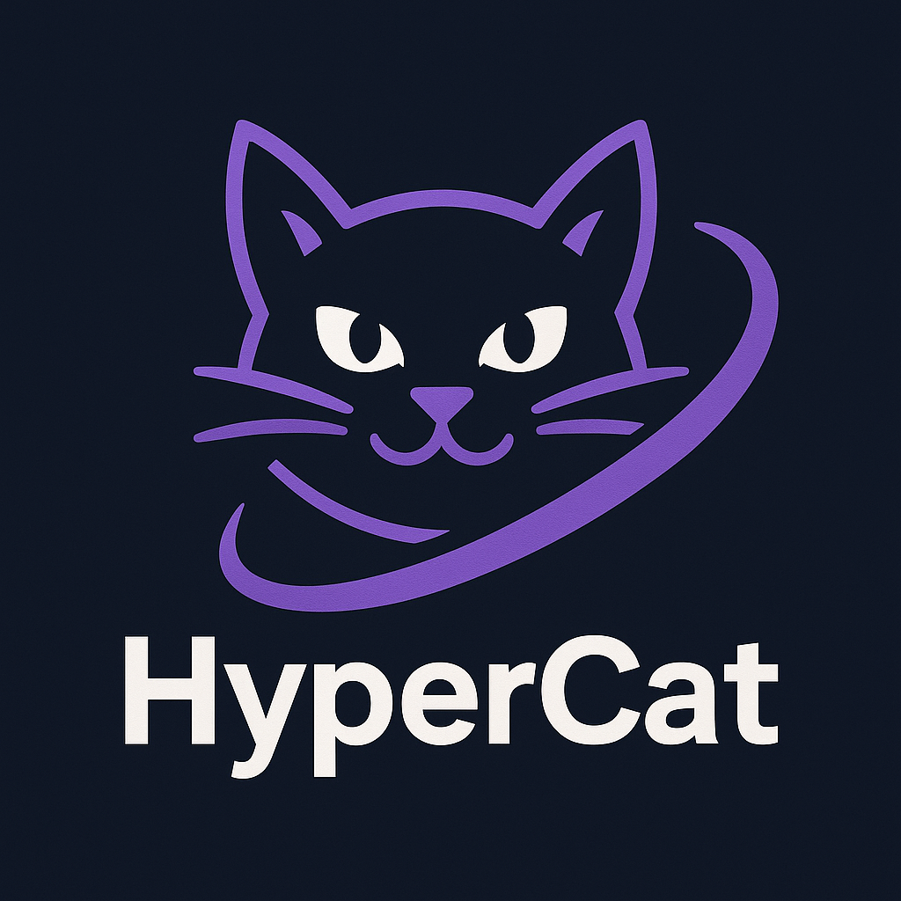

# 🐾 HyperCat

<p align="center">
  
</p>

> *A sleek and powerful Python library for modeling categories, functors, natural transformations, and 2-categories (hypercategories).*

---

## ✨ Features

- ✅ Object and morphism modeling  
- 🔁 Functors with composition and identity preservation  
- 🌀 Natural transformations with full naturality condition checks  
- 2️⃣ Support for 2-categories with vertical and horizontal 2-cell composition  
- 📦 Ready-to-use standard categories (e.g. Δⁿ, terminal, discrete, walking isomorphism)

---

## 🧠 Philosophy

**HyperCat** is inspired by the structural elegance of category theory and the agility of abstraction. It is ideal for:
- Research in category theory
- Computational category modeling
- Experimental algebraic topology
- Categorical machine learning foundations

---

## 🛠️ Installation

```bash
git clone https://github.com/Mircus/HyperCat.git
cd HyperCat
pip install -e .

